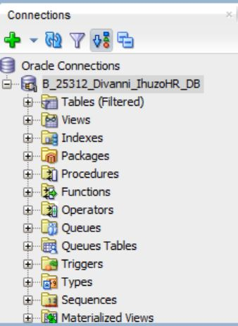
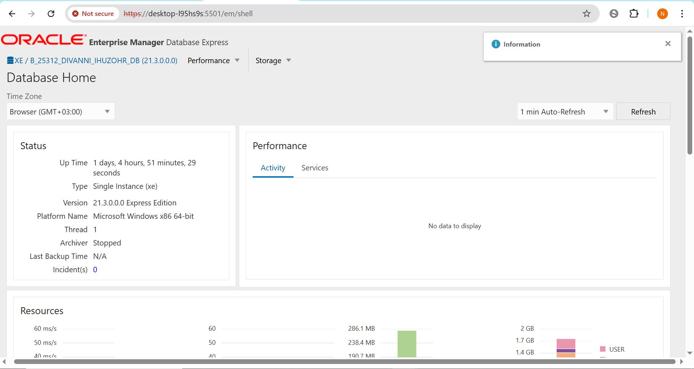

# Ihuzo HR System - Phase 4: Database Creation

## Database Information

- **Database Name:** B_25312_Divanni_IhuzoHR_DB
- **Admin User:** Divanni
- **Oracle Version:** 21.3.0.0.0 Express Edition

## Configuration Details

- PL/SQL Oracle Database
- Pluggable Database Architecture
- Enterprise Manager Configured on port 5500

## Implementation Steps

1. Created pluggable database with required naming convention
2. Configured admin user with appropriate privileges
3. Set up Oracle Enterprise Manager for monitoring
4. Tested database connection and functionality

## Screenshots

## Next Steps

- Proceed to database schema design
- Implement tables for the Ihuzo HR System recruitment process
- Set up security and access controls
