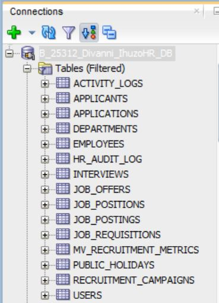
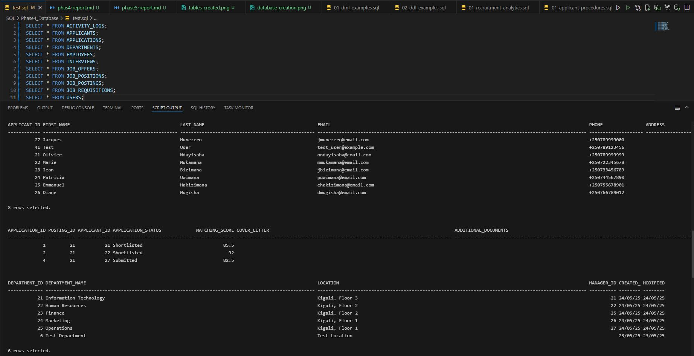
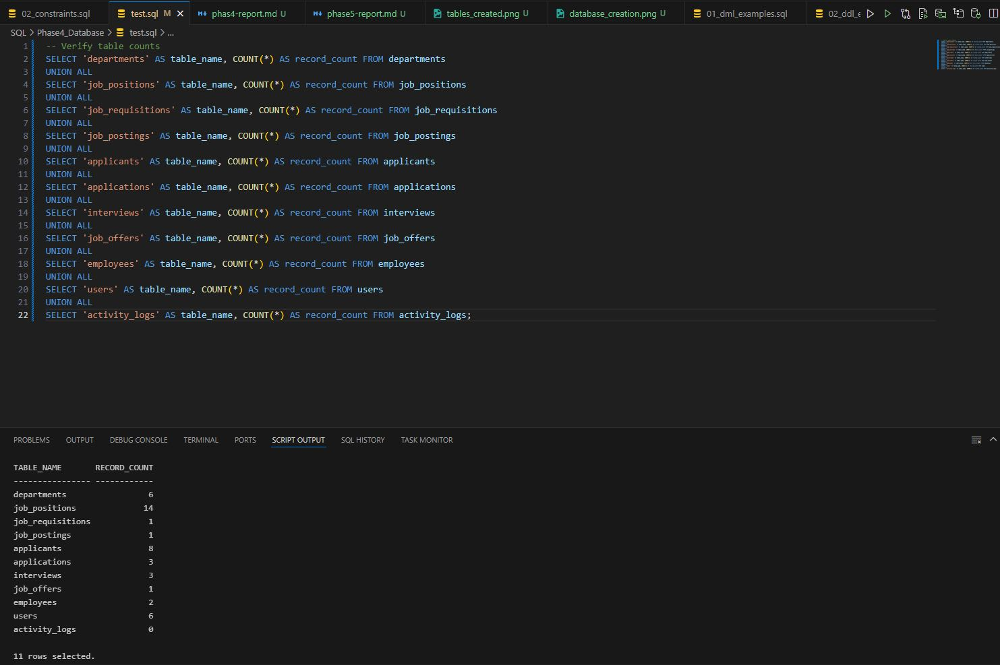

# Ihuzo HR System - Phase 5: Table Implementation and Data Insertion

## Overview

This phase involved the implementation of the physical database structure for the Ihuzo HR System, based on the business process modeling conducted in previous phases. The database tables represent the entities and relationships in the recruitment workflow.

## Database Structure

### Core Tables

1. **departments** - Organizational units
2. **job_positions** - Available roles in the organization
3. **users** - System users (Department Managers, HR Recruitment, System Administrators)

### Recruitment Process Tables

4. **job_requisitions** - Formal requests for new positions
5. **job_postings** - Public or internal advertisements for positions
6. **applicants** - Candidate information
7. **applications** - Job applications submitted by candidates
8. **interviews** - Interview scheduling and feedback
9. **job_offers** - Offers extended to candidates
10. **employees** - Hired applicants
11. **activity_logs** - System activity tracking

## Data Integrity Implementation

### Primary Keys

All tables have numeric primary keys with sequences for automatic generation.

### Foreign Keys

The database implements referential integrity through foreign key constraints:

- **job_requisitions** reference **departments**, **job_positions**, and **users**
- **job_postings** reference **job_requisitions** and **users**
- **applications** reference **job_postings** and **applicants**
- **interviews** reference **applications** and **users**
- **job_offers** reference **applications** and **users**
- **employees** reference **applicants**, **departments**, and **job_positions**

### Check Constraints

Data validity is enforced through check constraints:

- Status fields use enumerated values (e.g., 'Pending', 'Approved', 'Rejected')
- Date validation (e.g., target_hire_date >= request_date)

### Indexes

Performance optimization through strategic indexes:

- Columns frequently used in WHERE clauses
- Foreign key columns
- Status and date columns used for filtering

## Sample Data

The database is populated with realistic test data that represents a complete recruitment process:

- 5 departments with managers
- 8 job positions
- 4 job requisitions (3 approved, 1 pending)
- 3 job postings
- 6 applicants with varied skills and experience
- 6 applications
- 6 interviews (5 completed, 1 scheduled)
- 2 job offers (1 accepted, 1 sent)
- 1 new employee (hired through the system)

## Data Verification

The data integrity was verified through:

- Record count verification across all tables
- Foreign key relationship validation
- Workflow process validation (requisition → posting → application → interview → offer → hire)
- Complex query testing to ensure data supports all required reporting needs

## Next Steps

The physical database structure is now ready for:

- Integration with the application layer
- Implementation of advanced features (triggers, stored procedures)
- Development of reporting and analytics components

## Screenshots

