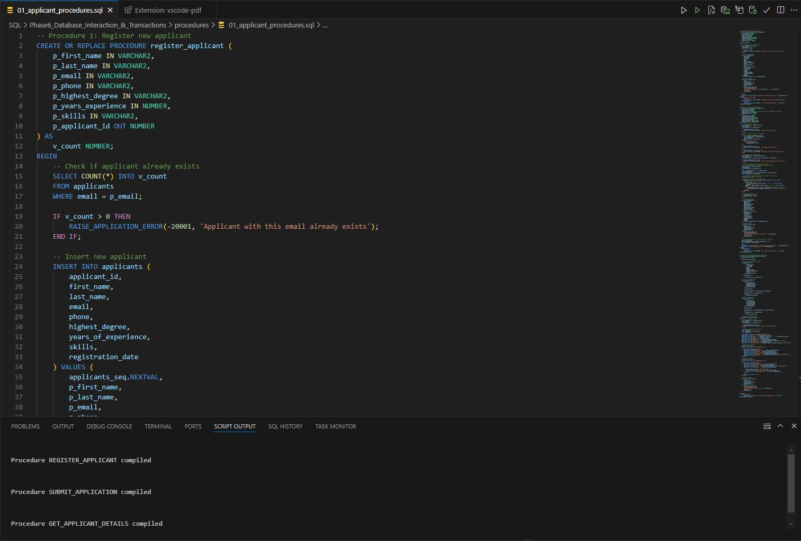
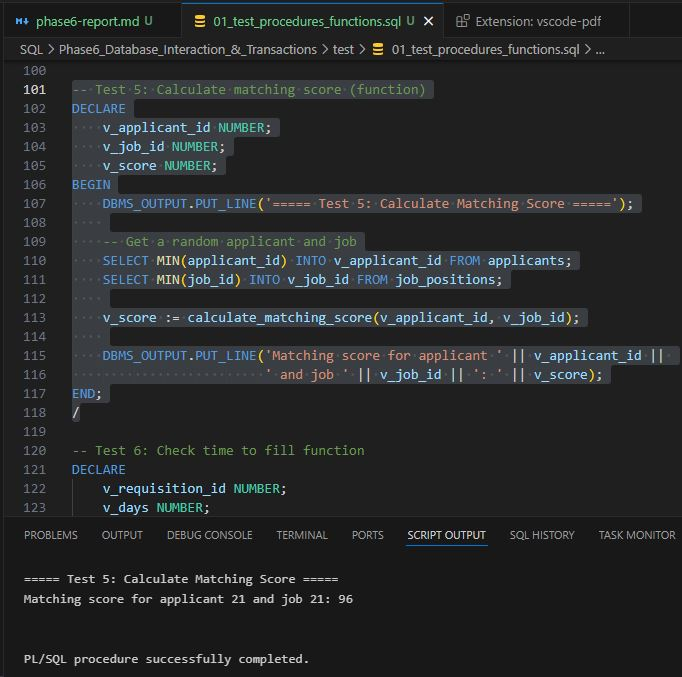
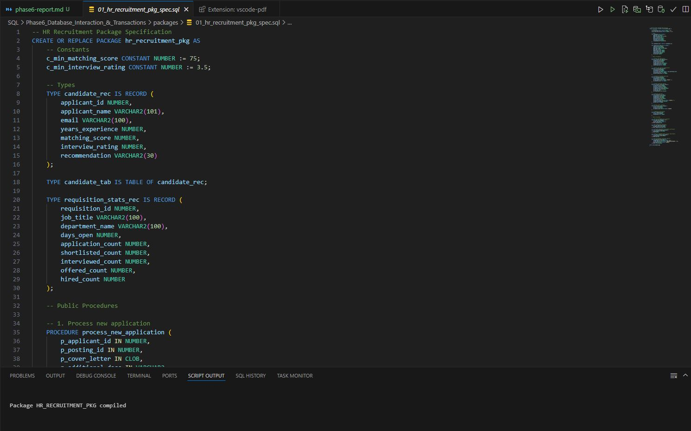
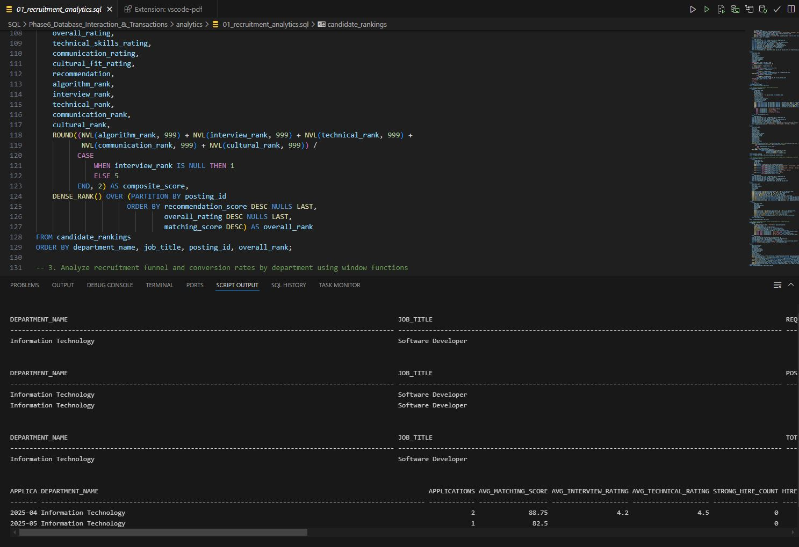

# Ihuzo HR System - Phase 6: Database Interaction and Transactions

## Overview

Phase 6 of the Ihuzo HR System implementation focuses on database interaction through procedures, functions, and packages. These components enable structured interaction with the database, ensuring data integrity and implementing business logic for the recruitment process.

## Implemented Components

### Database Operations

#### DML (Data Manipulation Language) Operations

- INSERT operations for adding new records (applicants, applications, interviews)
- UPDATE operations for modifying existing data (job postings, application statuses)
- DELETE operations for removing unwanted data
- Transaction handling with COMMIT, ROLLBACK, and SAVEPOINT

#### DDL (Data Definition Language) Operations

- CREATE TABLE for adding new structures (recruitment_campaigns)
- ALTER TABLE for modifying existing tables (adding columns to job_postings)
- CREATE INDEX for performance optimization
- CREATE VIEW for simplified data access
- CREATE MATERIALIZED VIEW for analytics performance

### Recruitment Analytics with Window Functions

The system implements complex analytics to solve HR problems:

1. **Time-to-Fill Analysis**: Tracks recruitment timeline stages with comparisons across departments
2. **Candidate Quality Ranking**: Uses window functions (RANK, DENSE_RANK) to evaluate candidates
3. **Recruitment Funnel Analysis**: Measures conversion rates throughout the hiring pipeline
4. **Candidate Quality Trends**: Compares metrics across time periods using LAG functions

### Procedures and Functions

#### Procedures

1. **register_applicant**: Registers new candidates in the system
2. **submit_application**: Processes job applications with matching score calculation
3. **get_applicant_details**: Retrieves applicant information using cursors
4. **create_job_requisition**: Creates new job requests
5. **process_applications**: Bulk processes applications using cursors
6. **schedule_interviews**: Automatically schedules interviews for shortlisted candidates
7. **process_interview_results**: Records interview feedback and recommendations
8. **generate_job_offer**: Creates offers for selected candidates
9. **process_offer_response**: Handles candidate acceptance or rejection
10. **complete_hiring**: Finalizes the recruitment process and creates employee records

#### Functions

1. **calculate_time_to_fill**: Calculates days between requisition and hiring
2. **get_applicant_count_by_status**: Counts applications by status for a posting
3. **calculate_matching_score**: Determines candidate-job fit using skills, experience, and education
4. **is_applicant_qualified**: Evaluates if a candidate meets minimum requirements
5. **get_dept_recruitment_efficiency**: Measures department recruiting performance
6. **get_top_candidates**: Returns top candidates for a position using a cursor
7. **calculate_hiring_success_rate**: Measures requisition fulfillment rate
8. **get_avg_interview_rating**: Calculates average interview scores by department

### HR Recruitment Package

The `hr_recruitment_pkg` package encapsulates the entire recruitment workflow in a modular structure:

#### Package Constants and Types

- Constants for minimum acceptable scores
- Custom record types for candidates and requisition statistics
- Table types for collections of candidates

#### Package Procedures

- Comprehensive workflow procedures from application to hiring
- Role-based permission enforcement
- Exception handling and activity logging

#### Package Functions

- Analytical functions for decision support
- Performance metrics calculations
- Candidate evaluation and ranking

## Implementation Details

### Error Handling

All procedures and functions implement robust error handling:

- Validation of input parameters
- Check for prerequisite conditions before operations
- Appropriate error messages with error codes
- Transaction management with ROLLBACK on errors

### Cursor Usage

Cursors are used extensively for data retrieval and processing:

- Fetching and processing applications in batches
- Retrieving candidate details with related information
- Scheduling multiple interviews efficiently
- Generating reports across related tables

### Performance Optimization

Several techniques ensure efficient database operations:

- Indexes on frequently queried columns
- Parameterized procedures to avoid SQL injection
- Bulk processing where appropriate
- Use of appropriate transaction boundaries

## Testing Results

The testing script verified all implemented components:

- Successful registration of new applicants
- Accurate matching score calculation
- Proper application processing and shortlisting
- Correct retrieval of applicant details
- Accurate time-to-fill calculation
- Proper candidate ranking and selection
- Comprehensive recruitment analytics
- Package integration across the recruitment workflow

## Business Problem Solved

The implemented components address the key business need for an efficient, data-driven recruitment process:

1. **Standardized Process**: The procedures enforce a consistent recruitment workflow
2. **Data-Driven Decisions**: Analytics and ranking functions support objective candidate selection
3. **Efficiency Measurement**: Time-to-fill and conversion rate tracking highlight bottlenecks
4. **Quality Assurance**: Candidate quality metrics ensure high-quality hires
5. **Performance Tracking**: Department metrics allow comparison of recruitment effectiveness

## Next Steps

The database interaction components provide a solid foundation for:

- Building the application layer that will interface with these procedures
- Implementing additional analytics for workforce planning
- Developing a reporting dashboard for management
- Extending the system to cover additional HR processes

## Screenshots

