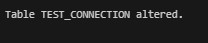

# Ihuzo HR System

## Table of Contents

- [Project Overview](#project-overview)
- [Project Owner](#project-by)
- [Problem Statement](#problem-statement)
- [System Architecture](#system-architecture)
- [Key Features](#key-features)
- [Implementation Highlights](#implementation-highlights)
- [Implentation Details](#implementation-details)

## Project Overview

The Ihuzo HR System is a comprehensive Human Resources Management System designed to streamline and automate the recruitment process, from job requisition to employee onboarding. The system provides secure data management, automated workflows, and analytics to support HR decision-making.

## Project By

Divanni Ntaganira

## Problem Statement

HR departments face challenges in managing the recruitment lifecycle efficiently while maintaining data security and compliance. The Ihuzo HR System addresses these challenges by:

1. Tracking time-to-fill metrics across departments and positions
2. Identifying which stages of the recruitment process take the longest
3. Calculating conversion rates from application to hire by department
4. Comparing recruitment costs versus quality of hires
5. Forecasting hiring needs based on historical data
6. Ensuring data security, integrity, and compliance

Additionally, the system needed to:

- Protect sensitive data from unauthorized modifications
- Restrict database operations during business hours and holidays
- Maintain comprehensive audit trails of all user interactions
- Automate business rule enforcement across multiple tables

The system enforces organizational policies, such as restricting database modifications during business hours and holidays to maintain data integrity and security.

[Read the complete problem statement here](PROBLEM_STATEMENT.md)

## System Architecture

The Ihuzo HR System is built on Oracle Database with a sophisticated PL/SQL backend. The architecture includes:

<!-- SCREENSHOT SUGGESTION: Include a system architecture diagram showing different components -->

.jpg>)

- **Database Layer**: Oracle Database 21c with advanced PL/SQL features
- **Analytics Layer**: Views, materialized views, and functions for performance analysis
- **Security Layer**: Audit logging, operation restrictions, and sensitive data protection
- **Business Logic Layer**: Procedures, packages, and triggers to enforce business rules
- **Data Storage Layer**: Normalized tables, indices, and constraints for data integrity

## Key Features

### Recruitment Process Management

- Job requisition creation and approval workflow
- Automated job posting and application tracking
- Candidate evaluation and matching algorithms
- Interview scheduling and feedback collection
- Offer generation and onboarding integration

### Advanced Database Programming

- PL/SQL procedures and functions for process automation
- Package implementation for modular functionality
- Transaction management for data integrity
- Exception handling for robust error management

### Security and Auditing

- Time-based access restrictions (weekdays and holidays)
- Comprehensive audit logging of all database activities
- Triggers to enforce security policies
- Detailed tracking of sensitive data modifications

### Analytics and Reporting

- Recruitment funnel analysis
- Time-to-fill metrics by department and position
- Candidate quality evaluation
- Department performance comparison


## Implementation Highlights

### Database Schema

The system uses a normalized database structure with properly defined relationships:


### Core Tables

- DEPARTMENT: Organizational structure
- JOB_POSITION: Available positions within departments
- JOB_REQUISITION: Open job requests with requirements
- JOB_POSTING: Published job advertisements
- APPLICANT: Candidate information
- APPLICATION: Job applications with status tracking
- RECRUITMENT_STAGE_LOG: Stage progression with durations
- INTERVIEW: Interview scheduling and feedback
- JOB_OFFER: Offer details and status
- RECRUITMENT_METRICS: Aggregated performance metrics
- SYSTEM_AUDIT_LOG: Security and operation audit trail
- PUBLIC_HOLIDAYS: Calendar of business holidays

### Core Procedures

The recruitment workflow is managed through a set of integrated procedures:

```sql
-- Procedure 1: Register new applicant
CREATE OR REPLACE PROCEDURE register_applicant (
    p_first_name IN VARCHAR2,
    p_last_name IN VARCHAR2,
    p_email IN VARCHAR2,
    p_phone IN VARCHAR2,
    p_highest_degree IN VARCHAR2,
    p_years_experience IN NUMBER,
    p_skills IN VARCHAR2,
    p_applicant_id OUT NUMBER
) AS
    v_count NUMBER;
BEGIN
    -- Check if applicant already exists
    SELECT COUNT(*) INTO v_count
    FROM applicants
    WHERE email = p_email;

    IF v_count > 0 THEN
        RAISE_APPLICATION_ERROR(-20001, 'Applicant with this email already exists');
    END IF;

    -- Insert new applicant
    INSERT INTO applicants (
        applicant_id,
        first_name,
        last_name,
        email,
        phone,
        highest_degree,
        years_of_experience,
        skills,
        registration_date
    ) VALUES (
        applicants_seq.NEXTVAL,
        p_first_name,
        p_last_name,
        p_email,
        p_phone,
        p_highest_degree,
        p_years_experience,
        p_skills,
        SYSDATE
    ) RETURNING applicant_id INTO p_applicant_id;

    -- Log the activity
    INSERT INTO activity_logs (
        log_id,
        activity_type,
        activity_description,
        related_entity,
        related_entity_id
    ) VALUES (
        activity_logs_seq.NEXTVAL,
        'APPLICANT_REGISTRATION',
        'New applicant registered: ' || p_first_name || ' ' || p_last_name,
        'applicants',
        p_applicant_id
    );

    COMMIT;
    DBMS_OUTPUT.PUT_LINE('Applicant registered successfully with ID: ' || p_applicant_id);
EXCEPTION
    WHEN DUP_VAL_ON_INDEX THEN
        ROLLBACK;
        RAISE_APPLICATION_ERROR(-20002, 'Duplicate value found. Registration failed.');
    WHEN OTHERS THEN
        ROLLBACK;
        RAISE_APPLICATION_ERROR(-20003, 'Error registering applicant: ' || SQLERRM);
END register_applicant;
/
```


```sql
-- Procedure 2: Submit job application
CREATE OR REPLACE PROCEDURE submit_application (
    p_applicant_id IN NUMBER,
    p_posting_id IN NUMBER,
    p_cover_letter IN VARCHAR2, -- Changed from CLOB to VARCHAR2 to avoid delays
    p_additional_docs IN VARCHAR2,
    p_application_id OUT NUMBER
) AS
    v_applicant_exists NUMBER;
    v_posting_exists NUMBER;
    v_posting_status VARCHAR2(20);
    v_duplicate_application NUMBER;
    v_matching_score NUMBER;
    v_applicant_skills VARCHAR2(500);
    v_required_skills VARCHAR2(500);
BEGIN
    -- Check if applicant exists
    SELECT COUNT(*) INTO v_applicant_exists
    FROM applicants
    WHERE applicant_id = p_applicant_id;

    IF v_applicant_exists = 0 THEN
        RAISE_APPLICATION_ERROR(-20004, 'Applicant ID does not exist');
    END IF;

    -- Check if posting exists and is published
    BEGIN
        SELECT COUNT(*), MAX(posting_status)
        INTO v_posting_exists, v_posting_status
        FROM job_postings
        WHERE posting_id = p_posting_id;
    EXCEPTION
        WHEN NO_DATA_FOUND THEN
            v_posting_exists := 0;
            v_posting_status := NULL;
    END;

    IF v_posting_exists = 0 THEN
        RAISE_APPLICATION_ERROR(-20005, 'Job posting does not exist');
    END IF;

    IF v_posting_status != 'Published' THEN
        RAISE_APPLICATION_ERROR(-20006, 'Job posting is not open for applications');
    END IF;

    -- Check for duplicate application
    SELECT COUNT(*) INTO v_duplicate_application
    FROM applications
    WHERE applicant_id = p_applicant_id AND posting_id = p_posting_id;

    IF v_duplicate_application > 0 THEN
        RAISE_APPLICATION_ERROR(-20007, 'You have already applied for this position');
    END IF;

    -- Calculate matching score (simplified algorithm)
    -- In real implementation, this would be more sophisticated
    SELECT skills INTO v_applicant_skills
    FROM applicants
    WHERE applicant_id = p_applicant_id;

    SELECT jr.required_skills INTO v_required_skills
    FROM job_postings jp
    JOIN job_requisitions jr ON jp.requisition_id = jr.requisition_id
    WHERE jp.posting_id = p_posting_id;

    -- Simple matching algorithm (would be more complex in real system)
    v_matching_score := 50; -- Base score

    -- Add points for skills match (simplified)
    IF v_applicant_skills IS NOT NULL AND v_required_skills IS NOT NULL THEN
        -- Check for major skill keywords
        FOR skill IN (
            SELECT REGEXP_SUBSTR(v_required_skills, '[^,]+', 1, LEVEL) AS skill
            FROM dual
            CONNECT BY REGEXP_SUBSTR(v_required_skills, '[^,]+', 1, LEVEL) IS NOT NULL
        ) LOOP
            IF INSTR(UPPER(v_applicant_skills), UPPER(TRIM(skill.skill))) > 0 THEN
                v_matching_score := v_matching_score + 10; -- 10 points per matching skill
            END IF;
        END LOOP;
    END IF;

    -- Cap the score at 100
    IF v_matching_score > 100 THEN
        v_matching_score := 100;
    END IF;

    -- Insert application
    INSERT INTO applications (
        application_id,
        posting_id,
        applicant_id,
        application_status,
        matching_score,
        cover_letter,
        additional_documents,
        submission_date,
        last_status_change
    ) VALUES (
        applications_seq.NEXTVAL,
        p_posting_id,
        p_applicant_id,
        'Submitted',
        v_matching_score,
        p_cover_letter,
        p_additional_docs,
        SYSDATE,
        SYSDATE
    ) RETURNING application_id INTO p_application_id;

    -- Log the activity
    INSERT INTO activity_logs (
        log_id,
        activity_type,
        activity_description,
        related_entity,
        related_entity_id
    ) VALUES (
        activity_logs_seq.NEXTVAL,
        'APPLICATION_SUBMISSION',
        'New application submitted for posting ID: ' || p_posting_id,
        'applications',
        p_application_id
    );

    -- Update application count for the posting (for analytics)
    UPDATE job_postings
    SET total_applications = NVL(total_applications, 0) + 1
    WHERE posting_id = p_posting_id;

    COMMIT;
    DBMS_OUTPUT.PUT_LINE('Application submitted successfully with ID: ' || p_application_id);
    DBMS_OUTPUT.PUT_LINE('Matching score: ' || v_matching_score);
EXCEPTION
    WHEN OTHERS THEN
        ROLLBACK;
        RAISE_APPLICATION_ERROR(-20008, 'Error submitting application: ' || SQLERRM);
END submit_application;
/
```


### Core DML Operations

```sql
-- DML Example 1: INSERT operation
-- Add a new job position
INSERT INTO job_positions (
    job_id, job_title, job_description, min_salary, max_salary
) VALUES (
    job_positions_seq.NEXTVAL, 'AI Specialist',
    'Responsible for developing and implementing artificial intelligence solutions. Experience with machine learning frameworks and natural language processing required.',
    1500000, 2300000
);
COMMIT;
```


```sql
-- DML Example 2: UPDATE operation
-- Update salary range for an existing position
UPDATE job_positions
SET min_salary = 1300000, max_salary = 2100000
WHERE job_title = 'Software Developer' AND ROWNUM = 1;
COMMIT;
```


### Core DDL Operations

```sql
-- DDL Example 2: ALTER - Add columns to an existing table
ALTER TABLE test_connection
ADD (
    campaign_id NUMBER,
    cost_per_click NUMBER(11,3),
    total_views NUMBER DEFAULT 0,
    total_applications NUMBER DEFAULT 0
);
```



```sql
-- DDL Example 4: CREATE VIEW - Create a view for easier reporting
CREATE OR REPLACE VIEW vw_application_status AS
SELECT
    d.department_name,
    jp.job_title,
    jpo.posting_title,
    ap.first_name || ' ' || ap.last_name AS applicant_name,
    ap.email AS applicant_email,
    a.application_status,
    a.matching_score,
    a.submission_date,
    i.interview_date,
    i.overall_rating,
    i.recommendation,
    jo.offer_status,
    jo.offered_salary
FROM
    departments d
JOIN job_requisitions jr ON d.department_id = jr.department_id
JOIN job_positions jp ON jr.job_id = jp.job_id
JOIN job_postings jpo ON jr.requisition_id = jpo.requisition_id
JOIN applications a ON jpo.posting_id = a.posting_id
JOIN applicants ap ON a.applicant_id = ap.applicant_id
LEFT JOIN interviews i ON a.application_id = i.application_id AND i.interview_status = 'Completed'
LEFT JOIN job_offers jo ON a.application_id = jo.application_id
ORDER BY d.department_name, jp.job_title, a.submission_date;
```


```sql
-- DDL Example 5: CREATE MATERIALIZED VIEW - For analytics performance
CREATE MATERIALIZED VIEW mv_recruitment_metrics
REFRESH COMPLETE ON DEMAND
AS
SELECT
    d.department_id,
    d.department_name,
    jp.job_id,
    jp.job_title,
    COUNT(DISTINCT jr.requisition_id) AS requisition_count,
    COUNT(DISTINCT jpo.posting_id) AS posting_count,
    COUNT(DISTINCT a.application_id) AS application_count,
    COUNT(DISTINCT CASE WHEN a.application_status = 'Shortlisted' THEN a.application_id END) AS shortlisted_count,
    COUNT(DISTINCT i.interview_id) AS interview_count,
    COUNT(DISTINCT jo.offer_id) AS offer_count,
    COUNT(DISTINCT CASE WHEN jo.offer_status = 'Accepted' THEN jo.offer_id END) AS accepted_offers,
    COUNT(DISTINCT e.employee_id) AS hired_count,
    ROUND(COUNT(DISTINCT CASE WHEN a.application_status = 'Shortlisted' THEN a.application_id END) /
          NULLIF(COUNT(DISTINCT a.application_id), 0) * 100, 2) AS shortlist_rate,
    ROUND(COUNT(DISTINCT CASE WHEN jo.offer_status = 'Accepted' THEN jo.offer_id END) /
          NULLIF(COUNT(DISTINCT jo.offer_id), 0) * 100, 2) AS offer_acceptance_rate,
    ROUND(AVG(i.overall_rating), 2) AS avg_interview_rating
FROM
    departments d
LEFT JOIN job_requisitions jr ON d.department_id = jr.department_id
LEFT JOIN job_positions jp ON jr.job_id = jp.job_id
LEFT JOIN job_postings jpo ON jr.requisition_id = jpo.requisition_id
LEFT JOIN applications a ON jpo.posting_id = a.posting_id
LEFT JOIN interviews i ON a.application_id = i.application_id
LEFT JOIN job_offers jo ON a.application_id = jo.application_id
LEFT JOIN applicants ap ON a.applicant_id = ap.applicant_id
LEFT JOIN employees e ON ap.applicant_id = e.applicant_id AND e.department_id = d.department_id
GROUP BY d.department_id, d.department_name, jp.job_id, jp.job_title;
```


### CORE Triggers

```sql
-- Compound trigger for salary-related tables (job_positions, job_offers, employees)
CREATE OR REPLACE TRIGGER trg_salary_audit_compound
FOR UPDATE OR INSERT OR DELETE ON job_positions
COMPOUND TRIGGER
    -- Define variables that are available for all timing points
    v_restricted BOOLEAN;
    v_operation VARCHAR2(10);
    v_record_id VARCHAR2(50);
    v_reason VARCHAR2(255);
    v_allowed BOOLEAN;

    -- Before statement section
    BEFORE STATEMENT IS
    BEGIN
        -- Check if operation is restricted
        v_restricted := is_restricted_time();
        v_allowed := NOT v_restricted;

        -- Set reason if restricted
        IF v_restricted THEN
            IF TO_CHAR(SYSDATE, 'DY') IN ('MON', 'TUE', 'WED', 'THU', 'FRI') THEN
                v_reason := 'Operation restricted during weekdays (Monday-Friday)';
            ELSE
                v_reason := 'Operation restricted during public holidays';
            END IF;
        END IF;
    END BEFORE STATEMENT;

    -- Before each row section
    BEFORE EACH ROW IS
    BEGIN
        -- Replace RETURN with IF-THEN structure
        IF NOT v_allowed THEN
            -- Determine operation type and record ID
            IF INSERTING THEN
                v_operation := 'INSERT';
                v_record_id := :NEW.job_id;
            ELSIF UPDATING THEN
                v_operation := 'UPDATE';
                v_record_id := :OLD.job_id;

                -- Special audit for salary changes
                IF :OLD.min_salary != :NEW.min_salary OR :OLD.max_salary != :NEW.max_salary THEN
                    -- Log the salary change attempt
                    INSERT INTO hr_audit_log (
                        audit_id,
                        username,
                        operation_type,
                        table_name,
                        record_id,
                        column_name,
                        old_value,
                        new_value,
                        operation_date,
                        operation_status,
                        denial_reason,
                        client_info,
                        os_user
                    ) VALUES (
                        hr_audit_seq.NEXTVAL,
                        USER,
                        'SALARY_UPDATE',
                        'JOB_POSITIONS',
                        v_record_id,
                        'MIN_SALARY,MAX_SALARY',
                        :OLD.min_salary || ',' || :OLD.max_salary,
                        :NEW.min_salary || ',' || :NEW.max_salary,
                        SYSTIMESTAMP,
                        'DENIED',
                        v_reason,
                        SYS_CONTEXT('USERENV', 'CLIENT_INFO'),
                        SYS_CONTEXT('USERENV', 'OS_USER')
                    );
                END IF;
            ELSE -- DELETING
                v_operation := 'DELETE';
                v_record_id := :OLD.job_id;
            END IF;

            -- Log the denied operation
            INSERT INTO hr_audit_log (
                audit_id,
                username,
                operation_type,
                table_name,
                record_id,
                operation_date,
                operation_status,
                denial_reason,
                client_info,
                os_user
            ) VALUES (
                hr_audit_seq.NEXTVAL,
                USER,
                v_operation,
                'JOB_POSITIONS',
                v_record_id,
                SYSTIMESTAMP,
                'DENIED',
                v_reason,
                SYS_CONTEXT('USERENV', 'CLIENT_INFO'),
                SYS_CONTEXT('USERENV', 'OS_USER')
            );

            -- Raise error to prevent the operation
            RAISE_APPLICATION_ERROR(-20001, v_reason);
        END IF;
    END BEFORE EACH ROW;

    -- After statement section (executes if statement is allowed)
    AFTER STATEMENT IS
    BEGIN
        -- Record that operations were allowed
        IF v_allowed THEN
            INSERT INTO hr_audit_log (
                audit_id,
                username,
                operation_type,
                table_name,
                operation_date,
                operation_status,
                client_info,
                os_user
            ) VALUES (
                hr_audit_seq.NEXTVAL,
                USER,
                'BATCH_OPERATION',
                'JOB_POSITIONS',
                SYSTIMESTAMP,
                'ALLOWED',
                SYS_CONTEXT('USERENV', 'CLIENT_INFO'),
                SYS_CONTEXT('USERENV', 'OS_USER')
            );
        END IF;
    END AFTER STATEMENT;
END trg_salary_audit_compound;
/
```


## Implementation Details

### Phase 4: Database (Pluggable Database) Creation and Naming

- PL/SQL Oracle database creation
- Oracle Enterprise Manager (OEM) implementation

### Phase 5: Table Implementation and Data Insertion

- Table Creation with appropriate columns and data types.
- Data Insertion
- Data Integrity Verification
- Package implementation for modular organization

### Phase 6: Database Interaction and Transactionsg

- Performing DML (Data Manipulation Language) and DDL (Data Definition Language)
  operations
- Creation of parameterized procedures for fetching values from your database.
- Use cursors to retrieve data from tables
- Retention policy implementation

### Phase 7: Advanced Database Programming and Auditing

- Trigger Implementation
- Auditing with Restrictions and Tracking
